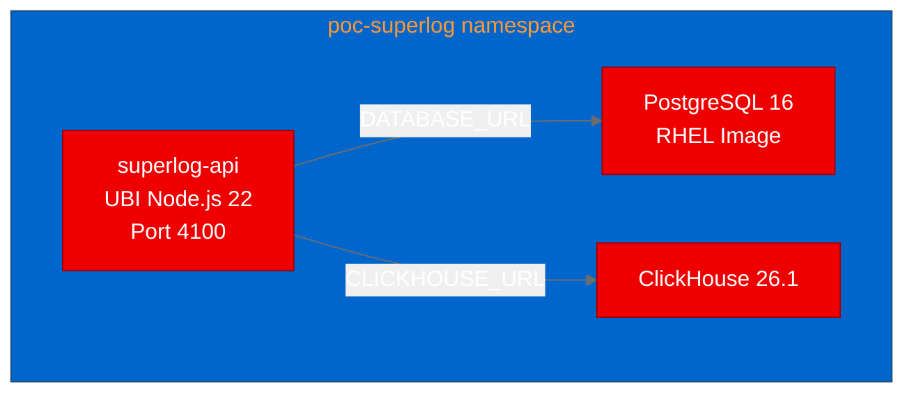

## What is Superlog?

[Superlog](https://github.com/superloglabs/superlog) is an open-source, agentic telemetry system built for teams running production services. It ingests OpenTelemetry traces, logs, and metrics, groups noisy signals into incidents, and gives operators a clean interface for debugging production issues. Think of it as a self-hosted alternative to Datadog or New Relic, built from the ground up around the OpenTelemetry standard.

The project ships as a TypeScript monorepo with four core services: an API server (Hono + Node.js), a React web frontend, an OTLP intake proxy, and a background worker for incident grouping and AI-powered investigation. It relies on PostgreSQL for relational data and ClickHouse for high-volume telemetry queries.

We set out to prove that this multi-component observability stack can run on Red Hat OpenShift using UBI-based container images.

## Why observability matters for AI workloads

Teams deploying model-serving endpoints, RAG pipelines, and agent runtimes on Red Hat OpenShift AI need the same production observability they expect for any critical service. Inference latency spikes, token throughput degradation, and model drift all surface as telemetry signals. Having an OpenTelemetry-native observability platform deployed alongside AI workloads means operators can correlate model behavior with infrastructure events without shipping data to external SaaS.

Superlog's incident grouping and AI investigation features are particularly relevant here. When a KServe endpoint starts returning elevated error rates, the system can automatically cluster related traces and logs into a single incident, reducing alert fatigue for platform teams.

## Containerizing a TypeScript monorepo with UBI

The existing Dockerfiles use `node:20-slim` with `corepack` for pnpm management. UBI Node.js images don't include corepack, so we installed pnpm via `npm install -g pnpm@9.12.0` instead.

The trickier issue was directory permissions. In a pnpm workspace, `pnpm install --filter @superlog/api...` creates `node_modules` directories inside workspace subdirectories. When `COPY` creates these directories as root-owned but the install runs as UID 1001, pnpm fails with `EACCES` errors. The fix is straightforward:

```dockerfile
FROM registry.access.redhat.com/ubi9/nodejs-22

WORKDIR /opt/app-root/src

USER 0
RUN npm install -g pnpm@9.12.0

COPY pnpm-lock.yaml pnpm-workspace.yaml package.json ./
COPY apps/api/package.json apps/api/
COPY packages/db/package.json packages/db/
COPY packages/fingerprint/package.json packages/fingerprint/

RUN chown -R 1001:0 /opt/app-root/src
USER 1001

RUN pnpm install --frozen-lockfile --filter @superlog/api...
```

The key pattern: `chown` the WORKDIR to UID 1001 after copying package manifests but before running the package manager. This lets the non-root user create workspace-scoped `node_modules` while maintaining OpenShift's security model.

For OpenShift compatibility, we added the standard group permissions before the final `USER` directive:

```dockerfile
USER 0
RUN chgrp -R 0 /opt/app-root && chmod -R g=u /opt/app-root
USER 1001
```

## Building and deploying to OpenShift

We used OpenShift's binary build strategy, which uploads local source to the cluster and builds the image on-cluster. This eliminates the need for a local container runtime:

```bash
oc new-build --name="superlog-api" \
  --binary --strategy=docker \
  --to-docker --to="quay.io/aicatalyst/superlog-api:latest" \
  --push-secret=autopoc-registry-push \
  -n autopoc-test-builds

oc start-build superlog-api \
  --from-dir="./repos/superlog" \
  --follow --wait \
  -n autopoc-test-builds
```

The build downloads 650 npm packages and completes in about 40 seconds. The resulting image is automatically pushed to Quay.io.

For the deployment, we created Kubernetes manifests for three components:



The RHEL PostgreSQL image (`registry.redhat.io/rhel9/postgresql-16`) creates the database automatically from the `POSTGRESQL_DATABASE` environment variable. The API runs migrations on boot via Drizzle ORM, so no manual schema setup is needed.

## Validating the deployment

We ran three HTTP test scenarios against the deployed API:

| Scenario | Result | Details |
|---|---|---|
| API Health Check | PASS | Server responds to HTTP requests (0.02s) |
| API Reference | PASS | API reference endpoint reachable |
| Auth Availability | PASS | BetterAuth returns `{"ok":true}` (0.01s) |

The `/api/auth/ok` endpoint confirms that the authentication system initialized correctly, including database connectivity, migration execution, and auth session management. Response times under 20ms indicate the API is fully operational with minimal overhead.

## Lessons learned

**UBI Node.js images and pnpm workspaces require explicit permission management.** The `corepack` tool isn't available, and COPY-created directories need ownership adjustment before non-root package installation. This is a repeatable pattern for any pnpm/yarn workspace project targeting UBI.

**RHEL PostgreSQL images have a specific user model.** You must set `POSTGRESQL_USER` to a non-`postgres` value and use `POSTGRESQL_ADMIN_PASSWORD` for superuser access. The database specified in `POSTGRESQL_DATABASE` is automatically created.

**OpenShift binary builds work well for monorepos.** The entire repository is uploaded as build context, and the `dockerfilePath` parameter lets you point to a specific Dockerfile without restructuring the project.

## Try it yourself

The complete deployment artifacts are available in the [aicatalyst-team/superlog](https://github.com/aicatalyst-team/superlog) fork:

- **UBI Dockerfile:** [`Dockerfile.ubi`](https://github.com/aicatalyst-team/superlog/blob/main/Dockerfile.ubi)
- **Kubernetes manifests:** [`kubernetes/`](https://github.com/aicatalyst-team/superlog/tree/main/kubernetes)
- **PoC report:** [`poc-report.md`](https://github.com/aicatalyst-team/superlog/blob/autopoc-artifacts/poc-report.md)
- **Container image:** `quay.io/aicatalyst/superlog-api:latest`

To deploy on your own OpenShift cluster, clone the fork, apply the manifests, and watch the API start with automatic database migrations. The full web frontend, OTLP proxy, and worker components are ready for containerization using the same UBI pattern.
