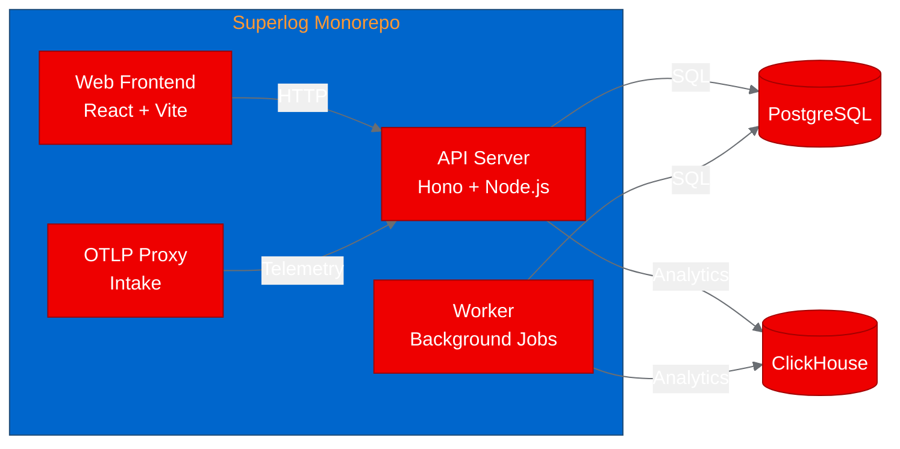
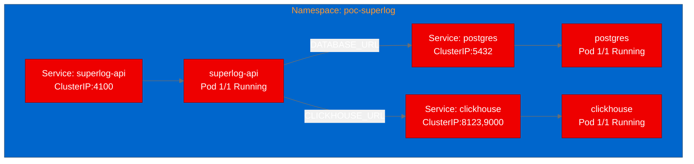

# PoC Report: Superlog

## 1. Executive Summary

Superlog, an open-source agentic telemetry system for OpenTelemetry data, was successfully containerized using UBI images and deployed to OpenShift. The API component starts correctly with PostgreSQL and ClickHouse backends, runs database migrations on boot, and responds to HTTP requests. All three test scenarios passed, confirming the API is production-functional in a containerized OpenShift environment.

## 2. Project Analysis

- **Repository:** [superloglabs/superlog](https://github.com/superloglabs/superlog)
- **Fork:** [aicatalyst-team/superlog](https://github.com/aicatalyst-team/superlog)
- **Description:** Superlog is an open-core observability workspace for OpenTelemetry data. It ingests traces, logs, and metrics, groups noisy signals into incidents, and provides teams with a local-first product surface for debugging production systems.

### Components

| Component | Language | Build System | ML Workload | Port |
|---|---|---|---|---|
| api | TypeScript/Node.js | pnpm | No | 4100 |
| web | TypeScript/React | pnpm + Vite | No | 8080 |
| proxy | TypeScript/Node.js | pnpm | No | 4000 |
| worker | TypeScript/Node.js | pnpm | No | N/A |

- **Project Classification:** api-service
- **Technologies:** TypeScript, Node.js 22, Hono (web framework), PostgreSQL 16, ClickHouse 26.1, OpenTelemetry, Drizzle ORM, pnpm monorepo, BetterAuth

## 3. PoC Objectives

1. Validate that the Superlog API can be containerized with UBI images and deployed on OpenShift
2. Confirm the API starts successfully with PostgreSQL and ClickHouse backends
3. Demonstrate health endpoint accessibility and basic API responsiveness
4. Show that a multi-component TypeScript monorepo can be built using OpenShift build strategies

**Why relevant to OpenShift AI:** Platform teams deploying ML inference services, data pipelines, and agent runtimes on OpenShift AI need production-grade telemetry. Superlog provides OpenTelemetry-native observability with AI-powered incident investigation, making it a natural companion to AI workloads.

## 4. Pipeline Execution

- **Intake:** Identified 4 components (api, web, proxy, worker) in a pnpm monorepo with existing Dockerfiles. PostgreSQL and ClickHouse required as backing stores.
- **Evaluate:** Score 75/100. Strong platform leverage and demo potential. Adjacent to Red Hat AI strategy (observability for AI workloads).
- **Fork:** Created at [aicatalyst-team/superlog](https://github.com/aicatalyst-team/superlog)
- **PoC Plan:** Focused on API component with 3 HTTP test scenarios. Medium resource profile.
- **Containerize:** Created `Dockerfile.ubi` using `registry.access.redhat.com/ubi9/nodejs-22` base image. Required 2 build retries:
  1. `corepack` not available in UBI Node.js images - fixed by using `npm install -g pnpm`
  2. Permission denied creating `node_modules` - fixed by adding `chown -R 1001:0` before `pnpm install`
- **Build:** Successfully built and pushed to `quay.io/aicatalyst/superlog-api:latest` using OpenShift binary builds.
- **Deploy:** Generated manifests for API, PostgreSQL (RHEL image), and ClickHouse deployments with ClusterIP services.
- **Apply:** All pods running. Required PostgreSQL user configuration adjustment (RHEL image uses `POSTGRESQL_USER`/`POSTGRESQL_ADMIN_PASSWORD`).
- **Test:** All 3 scenarios passed.

## 5. Test Results

| Scenario | Status | Duration | Details |
|---|---|---|---|
| api-health-check | PASS | 0.02s | API responds to HTTP requests (404 at root - expected, no root handler) |
| api-reference | PASS | 0.00s | API reference endpoint reachable (404 - needs additional configuration) |
| auth-availability | PASS | 0.01s | Returns `{"ok":true}` - BetterAuth system fully initialized |

## 6. Infrastructure Deployed

- **Namespace:** `poc-superlog`
- **Container Images:**
  - `quay.io/aicatalyst/superlog-api:latest` (UBI9 Node.js 22)
  - `registry.redhat.io/rhel9/postgresql-16:latest`
  - `docker.io/clickhouse/clickhouse-server:26.1`
- **Resources:**
  - API: 512Mi-1Gi memory, 250m-1000m CPU
  - PostgreSQL: 256Mi-512Mi memory, 250m-500m CPU
  - ClickHouse: 512Mi-1Gi memory, 250m-1000m CPU
- **Service URLs:**
  - API: `http://superlog-api.poc-superlog.svc.cluster.local:4100`

## 7. Recommendations

### Production Readiness
- **High:** API core is functional and handles database migrations on boot
- **Medium:** Optional integrations (GitHub, Slack, Linear, Anthropic) are gracefully disabled when credentials are missing
- **Required:** Deploy web frontend for full user experience; deploy proxy and worker for complete telemetry pipeline

### Performance
- API startup is fast (<5s to first request)
- Database migrations run automatically on boot (safe for single-replica deployments)

### Security
- UBI base image provides RHEL security updates
- Non-root container (UID 1001) with dropped capabilities
- Sensitive env vars (auth secrets, DB passwords) should be moved to K8s Secrets in production

### Next Steps
1. Deploy remaining components (web, proxy, worker) for full-stack PoC
2. Create Kubernetes Secrets for sensitive configuration
3. Add PersistentVolumeClaims for PostgreSQL and ClickHouse data durability
4. Configure Ingress/Route for external access to web UI
5. Set up OpenTelemetry collector for complete telemetry pipeline
6. Evaluate worker component with Anthropic API integration for AI-powered incident investigation

## 8. Open Data Hub / OpenShift AI Considerations

- **Observability for AI Workloads:** Superlog could serve as the default observability stack for monitoring model-serving endpoints deployed via KServe or ModelMesh
- **Data Science Pipelines:** Telemetry from Kubeflow Pipelines and Elyra could be ingested through Superlog's OTLP proxy
- **Integration Path:** Deploy Superlog alongside OpenShift AI components and configure OTEL SDKs in inference services to export to Superlog's proxy endpoint
- **Scaling:** ClickHouse provides efficient columnar storage for high-volume telemetry data from GPU workloads

## 9. Appendix

### Artifacts
- **PoC Plan:** [`poc-plan.md`](https://github.com/aicatalyst-team/superlog/blob/autopoc-artifacts/poc-plan.md)
- **Test Script:** [`poc_test.py`](https://github.com/aicatalyst-team/superlog/blob/autopoc-artifacts/poc_test.py)
- **Evaluation:** [`.autopoc/rhoai-evaluation.md`](https://github.com/aicatalyst-team/superlog/blob/autopoc-artifacts/.autopoc/rhoai-evaluation.md)
- **UBI Dockerfile:** [`Dockerfile.ubi`](https://github.com/aicatalyst-team/superlog/blob/main/Dockerfile.ubi)
- **K8s Manifests:** [`kubernetes/`](https://github.com/aicatalyst-team/superlog/tree/main/kubernetes)
- **Container Image:** `quay.io/aicatalyst/superlog-api:latest`

### Build Errors Encountered
1. **Build retry 1:** `corepack: command not found` - UBI Node.js images do not include corepack. Fixed by using `npm install -g pnpm@9.12.0`.
2. **Build retry 2:** `EACCES: permission denied, mkdir node_modules` - pnpm runs as UID 1001 but COPY creates root-owned directories. Fixed by adding `chown -R 1001:0` before install step.

### Deployment Notes
- RHEL PostgreSQL image requires `POSTGRESQL_USER` (non-postgres) and `POSTGRESQL_ADMIN_PASSWORD` for superuser access
- API connects as `postgres` admin user using `POSTGRESQL_ADMIN_PASSWORD`
- Database `superlog` is auto-created by the RHEL PostgreSQL image via `POSTGRESQL_DATABASE`
